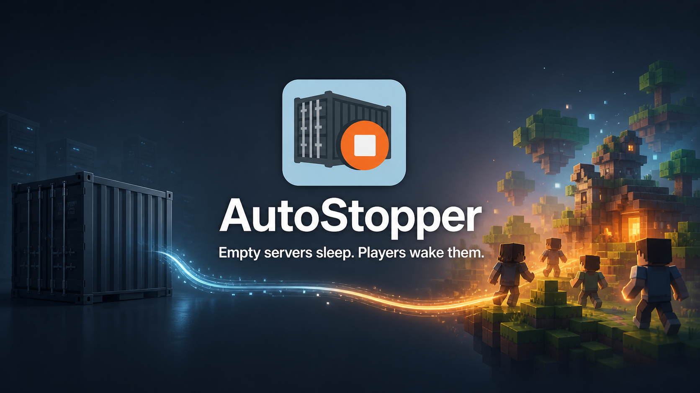

<h1 align="center">AutoStopper</h1>

<p align="center"><strong>Empty servers sleep. Players wake them.</strong></p>

<p align="center">
  Automatic, readiness-aware Docker lifecycle management for Velocity networks.
</p>

<p align="center">
  <a href="https://github.com/Criseda/AutoStopper/actions/workflows/ci.yml"></a>
  <a href="https://github.com/Criseda/AutoStopper/actions/workflows/release-candidate-e2e.yml"></a>
  <a href="#supported-runtimes"></a>
  <a href="#supported-runtimes"></a>
  <a href="https://modrinth.com/plugin/autostopper"></a>
  <a href="LICENSE"></a>
</p>

<p align="center">
  <a href="#installation">Installation</a> ·
  <a href="docs/configuration.md">Configuration</a> ·
  <a href="docs/troubleshooting.md">Troubleshooting</a> ·
  <a href="docs/migration-1.1.2-to-2.0.0.md">Migration</a> ·
  <a href="docs/releasing.md">Releasing</a> ·
  <a href="CONTRIBUTING.md">Contributing</a> ·
  <a href="CODE_OF_CONDUCT.md">Code of Conduct</a> ·
  <a href="SUPPORT.md">Support</a> ·
  <a href="SECURITY.md">Security</a> ·
  <a href="CHANGELOG.md">Changelog</a> ·
  <a href="https://modrinth.com/plugin/autostopper">Modrinth</a>
</p>

AutoStopper lets a Velocity network stop mapped Docker-based Minecraft servers when they are empty
and wake them automatically when players return. Startup waits for real Minecraft or Docker-health
readiness, simultaneous players share one lifecycle operation, and all Docker work stays off
Velocity's event and command workers.

> [!IMPORTANT]
> These instructions describe **AutoStopper 2.0.0**. Download only from the project's GitHub or
> Modrinth release pages and verify the published SHA-256 checksum before installation. Users of
> 1.1.2 should follow the complete migration guide before replacing the artifact.

## Why AutoStopper?

| | |
|---|---|
| **⚡ Wake on demand**<br>Players connect normally while AutoStopper starts a sleeping backend. | **🌙 Sleep when empty**<br>Mapped containers stop after a configurable player-free inactivity period. |
| **✓ Wait for real readiness**<br>Use Minecraft status, Docker health, or either signal—not a blind delay. | **👥 Share simultaneous startups**<br>Multiple arriving players wait on one bounded lifecycle operation. |
| **↻ Recover safely**<br>Failed stops retry with capped backoff; invalid reloads keep the prior configuration. | **◎ Diagnose quickly**<br>`/autostopper status` reports safe details and concrete operator actions. |

## Security boundary

> [!WARNING]
> **Docker socket access is host-root-equivalent.** The tested installation mounts
> `/var/run/docker.sock` into the Velocity container. Any process that can use that socket can
> control the Docker host with privileges effectively equivalent to root. Adding the `bungeecord`
> user to the socket's group changes which user can reach the socket; it does **not** create
> ordinary non-root isolation. Treat a compromise of Velocity, AutoStopper, another proxy plugin,
> or the proxy container as a compromise of the Docker host.

Use a dedicated host or VM where practical, install only trusted proxy plugins, restrict host and
Compose-file access, do not expose the Docker API over TCP, and grant the proxy access only on a
host whose containers it is allowed to control. A read-only socket mount is not sufficient because
AutoStopper must start and stop containers. See [Docker socket security](docs/security.md) before
installing. To report a suspected vulnerability privately, see [SECURITY.md](SECURITY.md).

## Supported runtimes

AutoStopper is one Java 21 bytecode JAR compiled against Velocity API 3.5.1. The same packaged JAR
is tested on the three runtime lines below; keep each proxy image and Velocity build together.

| Support line | Role | Proxy image | Proxy JVM | Velocity runtime | Example |
|---|---|---:|---:|---|---|
| Legacy | Minimum supported | `itzg/mc-proxy:2026.8.0-java21` | 21 | `3.5.1`, build `615` | [`examples/velocity-legacy`](examples/velocity-legacy/) |
| Stable | Production | `itzg/mc-proxy:2026.8.0-java25` | 25 | `4.0.0`, build `6` | [`examples/velocity-stable`](examples/velocity-stable/) |
| Preview | Snapshot validation | `itzg/mc-proxy:2026.8.0-java25` | 25 | `4.1.0-SNAPSHOT`, build `16` | [`examples/velocity-preview`](examples/velocity-preview/) |

The legacy line is the tested minimum; the stable line is the recommended production runtime.
Velocity 4.x requires at least Java 25, so do not run the stable or preview builds on Java 21.
Velocity 4.1 is currently supplied by PaperMC as a snapshot and is validated only as preview, not
as a production baseline. The release-candidate stack is tested with Purpur 1.21.4; backend Java
is independent of the proxy JVM. AutoStopper observes Velocity API events and a generic Minecraft
status request rather than backend-specific APIs, so it is compatible with Minecraft Java Edition
1.7.2 through 26.2 when used through a supported Velocity runtime; only the listed backend is
directly exercised. Other Velocity, Java, proxy-image, and backend combinations are not part of the
tested matrix.

## Installation

Prerequisites are Docker Engine with Linux containers and Docker Compose v2, enough access to create
the backend containers in advance, and acceptance of the security boundary above.

1. Copy one complete support-line directory to the Docker host. Do not combine the Java 21 image
   from the legacy example with the Java 25 Velocity 4.x builds from the stable or preview
   examples.
2. Download the 2.0.0 JAR from [GitHub Releases](https://github.com/Criseda/AutoStopper/releases) or
   [Modrinth](https://modrinth.com/plugin/autostopper) after it is published. Put the unchanged JAR
   at `velocity_server/plugins/AutoStopper.jar` inside the copied example directory.
3. Review the socket mount and entrypoint in `docker-compose.yml`, then start the stack:

   ```sh
   docker compose up -d
   ```

4. Add every managed backend to the `[servers]` section of
   `velocity_server/velocity.toml`. The key must exactly match AutoStopper's `server_name`:

   ```toml
   [servers]
   purpur = "purpur:25565"
   fabric = "fabric:25565"
   try = ["purpur"]
   ```

5. Edit the generated lowercase data path
   `velocity_server/plugins/autostopper/config.yml`. Start with one mapping if desired:

   ```yaml
   inactivity_timeout_seconds: 300
   shutdown_timeout_seconds: 10
   stop_retry:
     max_attempts: 3
     initial_backoff_seconds: 60
     max_backoff_seconds: 300
   monitored_servers:
     - server_name: purpur
       container_name: purpur-server
       readiness:
         strategy: minecraft_status
         target_host: purpur
         target_port: 25565
         probe_interval_millis: 1000
         timeout_seconds: 120
         connect_timeout_millis: 1000
         read_timeout_millis: 1000
   ```

6. Restart the proxy, or run `/autostopper reload` with the required permission. Verify startup and
   the mapping preflight:

   ```sh
   docker compose logs velocity
   docker compose ps
   ```

   In Velocity, `/autostopper status` should report the monitored server as `READY` or `STOPPED`.
   `DOCKER_UNAVAILABLE` or `FAILED` includes an operator-safe detail such as a missing container;
   raw Docker stderr remains only in the proxy log.

Managed containers must already exist and use `restart: "no"` so Docker does not immediately undo
an inactivity stop. Unmonitored hubs or lobbies are not intercepted or stopped by AutoStopper and
may retain `restart: unless-stopped`.

## Behavior

- A connection to a monitored server is held while AutoStopper inspects or starts its mapped
  container and completes the configured readiness check. Simultaneous players share that work.
- A connection to an unmonitored Velocity server proceeds normally; AutoStopper never infers a
  container name and never manages it.
- The inactivity scan runs once per minute. A mapped, running server with no players is stopped
  after its configured inactivity period.
- Failed and timed-out automatic stops retain activity and use bounded exponential retry. After the
  attempt limit, a new retry cycle requires another full inactivity period.
- A successful reload atomically replaces the configuration and runs a Docker mapping preflight. A
  malformed or invalid reload is rejected in full and the previous snapshot remains active.
- Proxy shutdown cancels plugin work within `shutdown_timeout_seconds`; it does not stop managed
  Minecraft containers.

See the [configuration reference](docs/configuration.md) and
[troubleshooting guide](docs/troubleshooting.md) for the complete contract.

## Commands and permissions

| Command | Required permission | Notes |
|---|---|---|
| `/autostopper`, `/as` | None | Shows plugin information. |
| `/autostopper help` | None | Shows only commands the source may use. |
| `/autostopper status` | `autostopper.command.status` or `autostopper.admin` | Collects current operational state for every mapping. |
| `/autostopper reload` | `autostopper.command.reload` or `autostopper.admin` | Atomically validates, applies, and preflights the new configuration. |

`autostopper.admin` is an explicit umbrella. If it is granted, it authorizes both restricted
commands even when a command-specific node is not granted. Automatic starts and stops have no
player permission node; normal Velocity connection rules still apply. AutoStopper does not register
or replace `/server`, does not check or change `velocity.command.server`, and exposes no manual
start or stop command.

## Building and verification

Builds require JDK 21 through 25. The committed Maven Wrapper pins Maven 3.9.16 and is the canonical
entry point:

```sh
./mvnw --batch-mode --no-transfer-progress clean verify
```

```powershell
.\mvnw.cmd --batch-mode --no-transfer-progress clean verify
```

The verified shaded JAR is written under `target/`. The optional packaged-runtime and live
release-candidate gates are documented in [`smoke/README.md`](smoke/README.md) and
[`e2e/README.md`](e2e/README.md).

## Development workflow

`master` is AutoStopper's sole authoritative development and release branch. All changes use
short-lived branches and pull requests; the former long-lived `dev` flow is retired. Required
checks, review and merge rules, branch cleanup, hotfixes, version ownership, tag points, and the
historical `dev`/`master` reconciliation are documented in
[`CONTRIBUTING.md`](CONTRIBUTING.md). The protected, byte-identical GitHub and Modrinth publication
flow is documented in [`docs/releasing.md`](docs/releasing.md).

## License and credits

AutoStopper is licensed under the [MIT License](LICENSE). It uses the
[`itzg/mc-proxy`](https://github.com/itzg/docker-mc-proxy) and
[`itzg/minecraft-server`](https://github.com/itzg/docker-minecraft-server) container projects.
